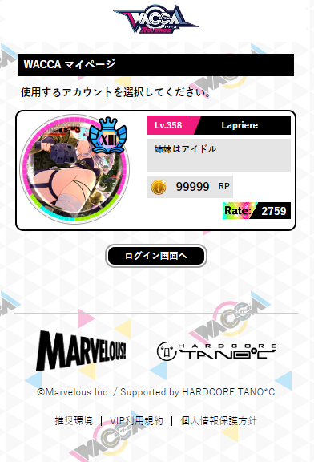

# Instructions

### Getting our Aime ID
Before we start, We need to retrieve Aime ID.  
Bookmark our script below to your Browser.

###### Bookmarklet
```javascript
javascript: (() => { var loginSelect = document.querySelector('section[class="login-select"] > ul'); var loginModals = document.querySelectorAll('[id^="modal_login"]'); loginModals.forEach((lm) => { var id = lm.querySelector('#aimeId').value; if (document.querySelector('#id_' + id)) return; var btnCpy = document.createElement('a'); btnCpy.id = 'id_' + id; btnCpy.href = `javascript: (() => {navigator.clipboard.writeText(${id}); alert('Your ID has been successfully copied to clipboard!');})()`; btnCpy.classList.add('btn'); var btnCpy_ul = document.createElement('ul'); btnCpy.appendChild(btnCpy_ul); var btnCpy_ul_li = document.createElement('li'); btnCpy_ul_li.appendChild(document.createTextNode('Click to Copy ID')); btnCpy_ul_li.style.color = 'black'; btnCpy_ul_li.style.justifyContent = 'center'; btnCpy_ul_li.style.marginBottom = '-13px'; btnCpy_ul.appendChild(btnCpy_ul_li); loginSelect.insertBefore(btnCpy, loginSelect.querySelector(`a[data-izimodal-open="#${lm.id}"]`)); }); })()
```

When you login to your [WACCA mypage](https://wacca.marv-games.jp/web/login), the following page will appear.  



when you execute our bookmark script (or paste it into developer console) the following button will appear in our page.  
the new button will copy our Aime ID to your clipboard.  

 


### Program Introduction
[Download The Latest Release](https://github.com/XezolesS/WaccaMyPageScraper/releases/latest)<br>
[.NET 6 Runtime](https://dotnet.microsoft.com/en-us/download/dotnet/6.0)<br>


1. Paste your **copied Aime ID** to this box.
2. Press the **login button** to log in to your Aime ID. You **must login** to download your data.
3. This button begins the process of **fetching our data**.
4. This is the **download progress bar**.
5. The tabs are used to **navigate to whatever data** you want to look at.
6. These buttons are used to **filter through Difficulties**. It's ``Normal``, ``Hard``, ``Expert``, ``Inferno`` from Left to Right to their corresponding colors.
7. This is the **song search bar**.
8. This chooses our **sorting method**. Your options are ``Default``, ``Name``, ``Artist``, ``Level``, ``Score``, ``Play Count``.
9. This is the button to our sort between Ascending or Descending Order.

**! NOTE: you MUST press fetch on EACH tab to get all your data!**

#### Each Tab's UI


### How my Data is stored
Your data will be stored in the ``data/`` folder of the program  
Stage, Trophy icons are embedded in the program, but album covers are scraped from the website (stored in ``data/records/image``)  
Every data is stored in csv format.  

### Troubleshooting

#### The program won't open!

You probably don't have .NET 6 runtime installed.

#### Pressing the copy ID button doesn't do anything!

In that case open your devtools/Inspect Element (F12), and navigate to the Copy ID element shown in the image below.

 

your ID will be in the function ``navigator.clipboard.writeText()`` or as an element id ``id_(youridhere)`` the ``<a>`` element.
