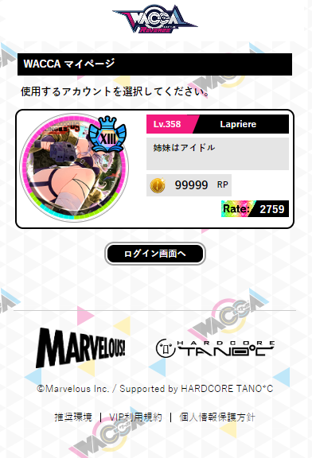
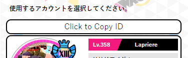
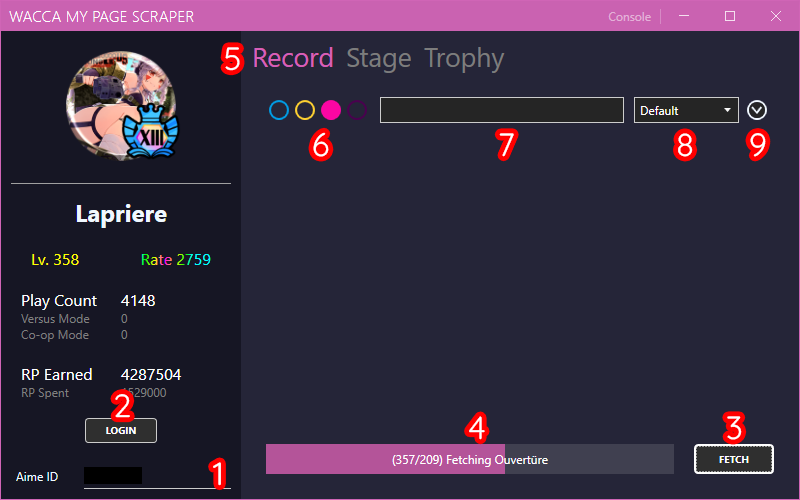
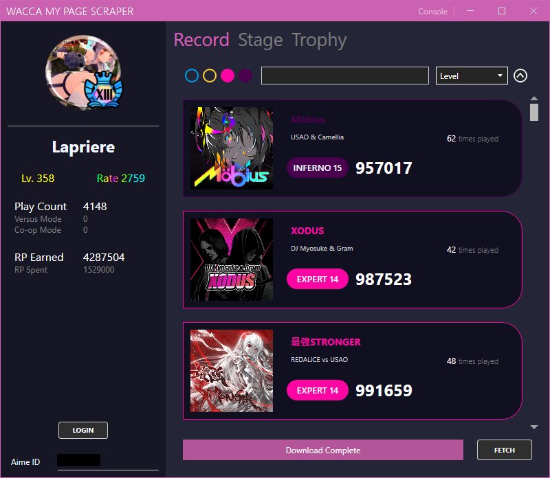
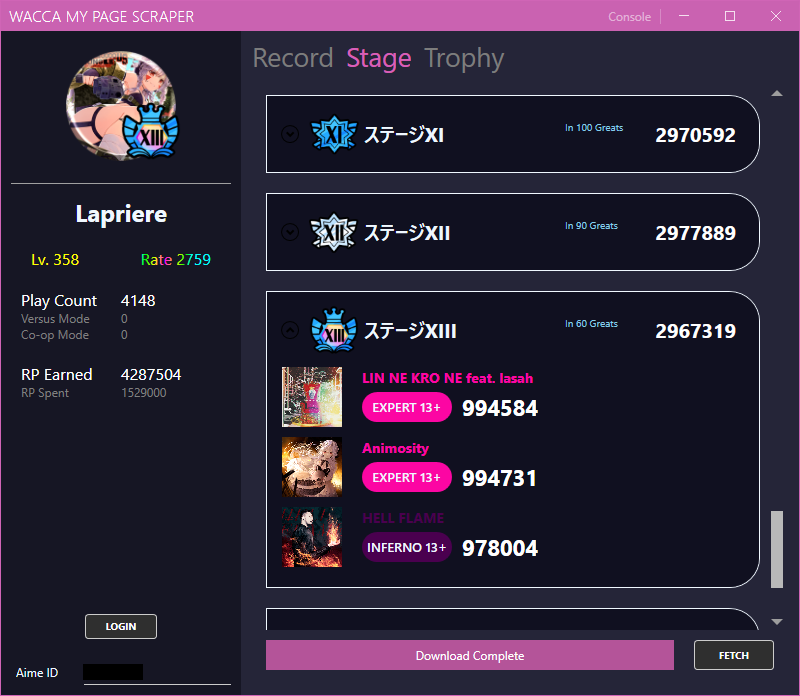

# 使い方

### Aime ID のインポート
本プログラムを実行する前に、 Aime ID を読み込む必要があります。<br>
下記のスクリプトをブラウザーのブックマークに登録します。

###### Bookmarklet
```javascript
javascript: (() => { var loginSelect = document.querySelector('section[class="login-select"] > ul'); var loginModals = document.querySelectorAll('[id^="modal_login"]'); loginModals.forEach((lm) => { var id = lm.querySelector('#aimeId').value; if (document.querySelector('#id_' + id)) return; var btnCpy = document.createElement('a'); btnCpy.id = 'id_' + id; btnCpy.href = `javascript: (() => {navigator.clipboard.writeText(${id}); alert('Your ID has been successfully copied to clipboard!');})()`; btnCpy.classList.add('btn'); var btnCpy_ul = document.createElement('ul'); btnCpy.appendChild(btnCpy_ul); var btnCpy_ul_li = document.createElement('li'); btnCpy_ul_li.appendChild(document.createTextNode('Click to Copy ID')); btnCpy_ul_li.style.color = 'black'; btnCpy_ul_li.style.justifyContent = 'center'; btnCpy_ul_li.style.marginBottom = '-13px'; btnCpy_ul.appendChild(btnCpy_ul_li); loginSelect.insertBefore(btnCpy, loginSelect.querySelector(`a[data-izimodal-open="#${lm.id}"]`)); }); })()
```

WACCA マイページにログインすると以下のような画面になります。<br>



このページで登録したブックマークを実行すると、以下のボタンが生成されます。<br>
このボタンをクリックすれば Aime ID をクリップボードにコピーすることができます。<br>

 


### プログラムの説明
[最新のダウンロードリンク](https://github.com/XezolesS/WaccaMyPageScraper/releases/latest)<br>
[.NET 6 Runtime](https://dotnet.microsoft.com/en-us/download/dotnet/6.0)<br>



1. ここに <b>コピーした Aime ID </b> を貼り付けます。
2. <b>ログインボタン</b>。 押せば入力した Aime ID でページにログインします。 3回データをダウンロードする必要があるため必ずログインしてください。
3. <b>データのダウンロードボタン</b>。 Aime ID に登録されたデータをダウンロードします。
4. <b>ダウンロードの進捗表示バー</b>。
5. <b>タブ</b>。 取得したデータの情報をタブで切り替えることができます。
6. <b>難易度のフィルタ</b>。 左側から Normal, Hard, Expert, Inferno の順になっています。
7. <b>検索欄</b>。 検索対象は曲名とアーティスト名です。
8. <b>ソート欄</b>。 デフォルト、曲名、アーティスト名、レベル、スコア、プレイカウントでソートが可能です。
9. <b>並び替え欄</b>。 降順 / 昇順 で並び替えることができます。

#### 各タブの UI




### ファイル保存方式
ダウンロードしたフォルダの<b>`/data` フォルダ</b>内に保存されます。<br>
ステージ、トロフィーアイコンなどはプログラム内に内蔵されていますが、曲のジャケット画像はデータ取得時にダウンロードされます。(data/records/image に保存されます。)<br>
ユーザーの各記録データは.csvファイルで保存されます。