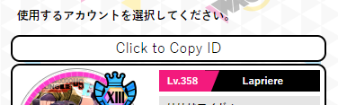
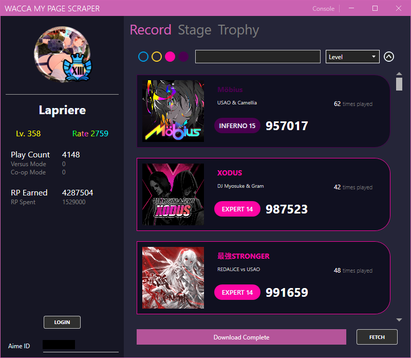

# 사용 가이드

### Aime ID 가져오기
프로그램 시작에 앞서, 유저의 Aime ID를 불러올 필요가 있습니다.<br>
아래의 스크립트를 브라우저의 북마크에 등록합니다.

###### Bookmarklet
```javascript
javascript: (() => { var loginSelect = document.querySelector('section[class="login-select"] > ul'); var loginModals = document.querySelectorAll('[id^="modal_login"]'); loginModals.forEach((lm) => { var id = lm.querySelector('#aimeId').value; if (document.querySelector('#id_' + id)) return; var btnCpy = document.createElement('a'); btnCpy.id = 'id_' + id; btnCpy.href = `javascript: (() => {navigator.clipboard.writeText(${id}); alert('Your ID has been successfully copied to clipboard!');})()`; btnCpy.classList.add('btn'); var btnCpy_ul = document.createElement('ul'); btnCpy.appendChild(btnCpy_ul); var btnCpy_ul_li = document.createElement('li'); btnCpy_ul_li.appendChild(document.createTextNode('Click to Copy ID')); btnCpy_ul_li.style.color = 'black'; btnCpy_ul_li.style.justifyContent = 'center'; btnCpy_ul_li.style.marginBottom = '-13px'; btnCpy_ul.appendChild(btnCpy_ul_li); loginSelect.insertBefore(btnCpy, loginSelect.querySelector(`a[data-izimodal-open="#${lm.id}"]`)); }); })()
```

WACCA 마이페이지에 로그인하면 아래와 같은 페이지가 나타납니다.<br>


위 페이지에서 방금 등록한 북마크 스크립트를 실행시키면 아래와 같은 버튼이 생성됩니다.<br>
이 버튼을 클릭하면 유저의 아이메 ID를 클립보드에 복사합니다.<br>

 


### 프로그램 설명
[다운로드(최신 릴리즈) 바로가기](https://github.com/XezolesS/WaccaMyPageScraper/releases/latest)<br>
[.NET 6 Runtime](https://dotnet.microsoft.com/en-us/download/dotnet/6.0)<br>


1. 이곳에 복사한 <b>Aime Id를 붙여넣기</b> 합니다.
2. <b>로그인 버튼</b>. 누르면 입력한 Aime Id로 페이지에 로그인합니다. 3번 버튼을 사용하기 위해 필수적으로 로그인해야 합니다.
3. <b>데이터 다운로드 버튼</b>. 해당하는 데이터를 다운로드합니다.
4. <b>다운로드 진행 표시줄</b>.
5. <b>탭</b>. 해당하는 데이터를 표시하거나 작업하기 위한 탭으로 전환합니다.
6. <b>난이도 필터링</b>. 좌측부터 Normal, Hard, Expert, Inferno순입니다.
7. <b>곡 검색</b>. 검색 대상은 곡 제목과 작곡가입니다.
8. <b>정렬 기준</b>. 기본, 제목, 작곡가, 레벨, 점수, 플레이 카운트를 기준으로 정렬합니다.
9. <b>정렬 방식</b>. 내림차순/올림차순으로 정렬 방식을 전환합니다.

#### 각 탭의 UI



### 파일 저장 방식
프로그램의 데이터 폴더는 <b>프로그램 경로 상의 data 폴더</b> 입니다.<br>
스테이지, 트로피 아이콘 등은 프로그램 내에 내장되어 있지만 곡의 자켓 이미지는 사용자가 프로그램으로 직접 다운로드 합니다. (data/records/image에 저장됨)<br>
유저의 각 기록 데이터는 .csv 파일로 저장됩니다.<br>
