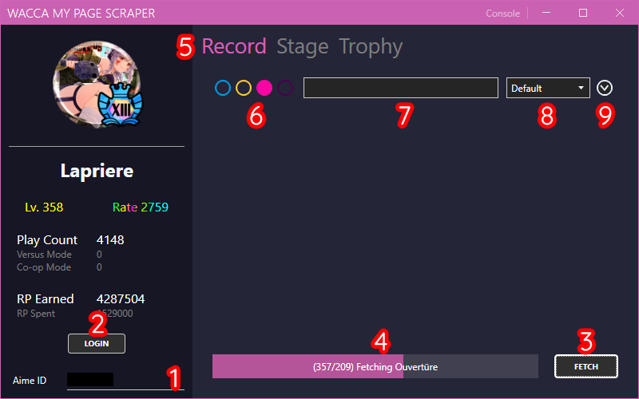

# 前置動作

### Getting our Aime ID
在開始抓資料之前, 我們需要先得到你的 Aime ID.  
打開遊覽器，製作一個新的書籤，並將以下指令放在書籤網址內

###### 書籤網址
```javascript
javascript: (() => { var loginSelect = document.querySelector('section[class="login-select"] > ul'); var loginModals = document.querySelectorAll('[id^="modal_login"]'); loginModals.forEach((lm) => { var id = lm.querySelector('#aimeId').value; if (document.querySelector('#id_' + id)) return; var btnCpy = document.createElement('a'); btnCpy.id = 'id_' + id; btnCpy.href = `javascript: (() => {navigator.clipboard.writeText(${id}); alert('Your ID has been successfully copied to clipboard!');})()`; btnCpy.classList.add('btn'); var btnCpy_ul = document.createElement('ul'); btnCpy.appendChild(btnCpy_ul); var btnCpy_ul_li = document.createElement('li'); btnCpy_ul_li.appendChild(document.createTextNode('Click to Copy ID')); btnCpy_ul_li.style.color = 'black'; btnCpy_ul_li.style.justifyContent = 'center'; btnCpy_ul_li.style.marginBottom = '-13px'; btnCpy_ul.appendChild(btnCpy_ul_li); loginSelect.insertBefore(btnCpy, loginSelect.querySelector(`a[data-izimodal-open="#${lm.id}"]`)); }); })()
```

當你登入 [WACCA mypage](https://wacca.marv-games.jp/web/login), 會出現以下畫面.  


當你點下你剛剛製作好的書籤後 (或直接將javascript指令粘貼到console執行) 將會出現一個按鈕.  
點下按鈕後，就會自動幫你複製你的Aime ID.  

 


### 應用程式教學
[下載我們最新的應用程式](https://github.com/XezolesS/WaccaMyPageScraper/releases/latest)<br>
[.NET 6 Runtime](https://dotnet.microsoft.com/en-us/download/dotnet/6.0)<br>



1. 將已經複製好的Aime ID貼上。
2. 點選 ``LOGIN`` 按鈕。
3. 點選 ``FETCH`` 開始將截取你的遊玩資料。
4. 進度條。
5. 這些按鈕可讓你切換分頁來遊覽不同的遊玩資料： ``遊玩記錄`` ``段位`` ``獎杯`` 。
6. 根據按鈕顏色來過濾遊玩資料，按鈕顏色分別是 ``NORMAL`` ， ``HARD`` ， ``EXPERT `` ， ``INFERNO``
7. 可輸入歌曲名稱搜尋遊玩資料。
8. 選取排序方式。
9. 選擇排序順序。

**！注意: 每個分頁都需要個別去截取一次資料才能顯示遊玩資料！**

#### 每個分頁畫面


### 資料是怎麼儲存的：
所有已截取的遊玩資料將以 ``.csv`` 格式儲存在此應用程式文件夾內的 ``data`` 文件夾內
段位，獎杯圖示是內嵌在程式內的，歌曲封面則是直接從官網上截取下來，儲存在 ``data/records/image`` 。


### FAQ

#### 我的程式打不開！

87%機率沒安裝到 ``.NET 6`` ，請回顧 ``應用程式教學`` 步驟

#### 按 copy ID 的按鈕不會幫我複製 Aime ID

這時候請按下鍵盤上的F12 (沒用的話就 Fn+F12）, 然後照著下面圖示的打開元素
 

你的 Aime ID 會存放在 function ``navigator.clipboard.writeText()`` 或存為元素 ``id_(你的id)`` 的 ``<a>`` 內容。
